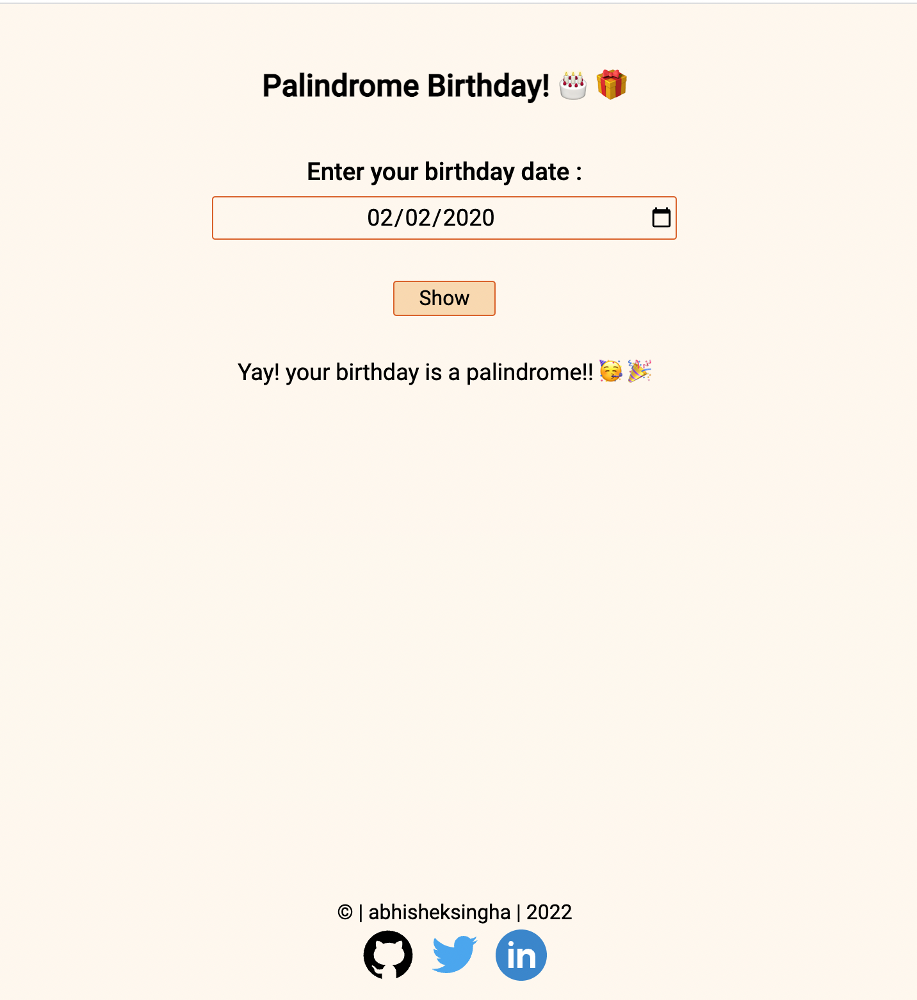

# palindrome-birthdays

App which checks whether your birthday is a palindrome birthday or not.

## Demo -

You can view this app live here - [Demo](https://)

## Tech Stack -

HTML, JavaScript, CSS for styling

## Documentation -

This app is built using HTML, JavaScript and CSS for styling. Tell whether the user was born on a palindrome day or not.

 Features -
- Take user's complete birthday as input.
- Take any one of these formats to put dates eg: MM/DD/YYYY, DD/MM/YYYY, MM/DD/YY, etc.
- Show the output if the birthdate is palindrome or not.

## Screenshots -

## Author -

- Abhishek Singha - [abk9778singha](https://github.com/abk9778singha)

